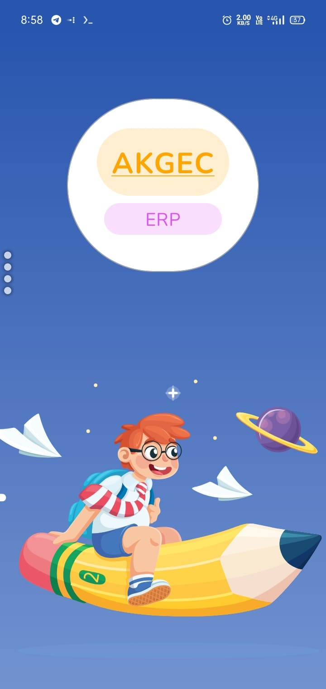
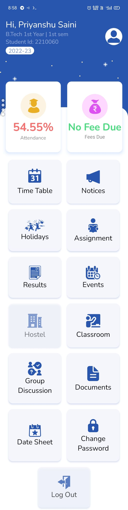
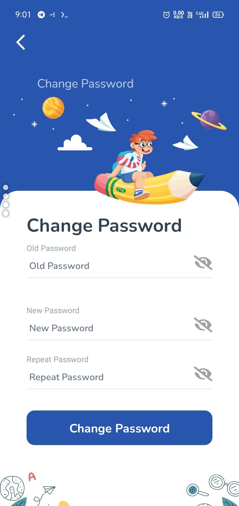
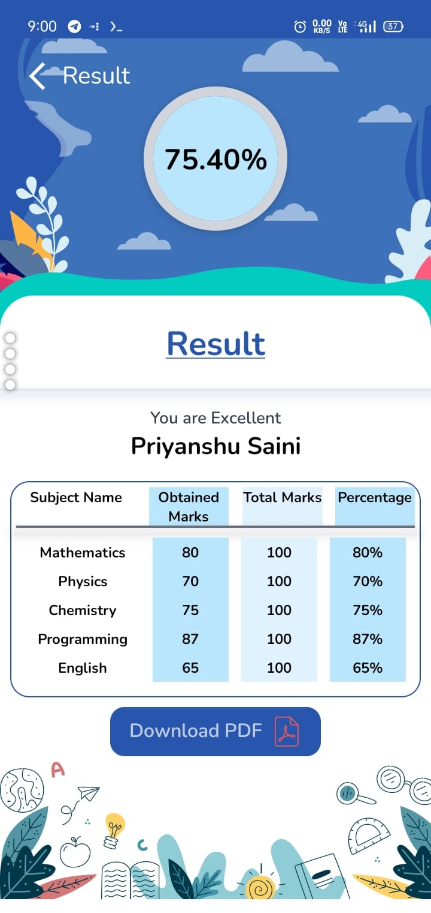

# AKGEC ERP App (Unofficial Concept)

  


A comprehensive and concept ERP app developed for AKGEC ERP using React Native, Firebase, and Next.js.

## Table of Contents

- [About the Project](#about-the-project)
  - [Built With](#built-with)
- [Features](#features)
- [Getting Started](#getting-started)
  - [Prerequisites](#prerequisites)
  - [Installation](#installation)
- [Usage](#usage)
- [Screenshots](#screenshots)
- [Contributing](#contributing)
- [License](#license)
- [Contact](#contact)

## About the Project

AKGEC Erp is the concept project created by [Priyanshu Sain](https://github.com/priyanshusaini105) for providing better, a centralized platform for students and staff to manage various aspects of college life.  
The ERP App is a sophisticated and user-friendly solution developed to streamline various administrative and student-related activities at a college. This project was initiated with the goal of enhancing communication, simplifying processes, and promoting efficient management within the college community.

### Built With

- React Native (for App)
- Firebase (Authentication, Realtime Database, Filestore)
- Next.js (for Admin Panel)
- Tailwind CSS
- React Hooks Forms
- React Navigation

## Features

- Manage attendance, notices, assignments, fees, timetable, results, events, classes , datesheet and documents.
- Secure authentication and real-time data updates using Firebase.
- User-friendly UI with seamless navigation.
- Admin panel for centralized management and control.


## Getting Started

To get a local copy up and running, follow these steps.

### Prerequisites

- [Node.js](https://nodejs.org/)
- [npm](https://www.npmjs.com/) or [Yarn](https://yarnpkg.com/)

### Installation

1. setup react native env as per [React Native Docs](https://reactnative.dev/docs/environment-setup)
2. Clone the repo
   `git clone https://github.com/priyanshusaini105/AKGEC.git`
3. Install NPM/Yarn packages

```
npm install
# or
yarn
```

4. Start the development server

```
npm start
# or
yarn start
```
## Screenshots

## Screenshots

<div style="display: flex; flex-direction: row; justify-content: space-between; align-items: center;">
  
  
  
</div>

<div style="text-align: center;">
  <p>Dashboard - Description of the dashboard.</p>
  <p>Sign In - Description of the sign-in screen.</p>
  <p>Result - Description of the result screen.</p>
</div>


[...Many more](./src/assets/screenShots/)

### Contributing
Contributions are welcome! Please follow these guidelines.

1.Fork the project.
2.Create your feature branch: git checkout -b feature/YourFeature
3.Commit your changes: git commit -m 'Add some feature'
4.Push to the branch: git push origin feature/YourFeature
5.Open a pull request.

### Steps to add new screen

Step 1: create its folder and component and expoert it through index.ts in screen folder .  
Step 2: Goto types.d.ts of navigation folder and add the screen to the stack or whatevre navigator params list
Step 3: Add scren to navigator.  
additional steps for dashboard items.  
Step 4: go to dashboarditems.ts in constant and register i mean add screen here also in type.d.ts of constants add name to dashboarditem targets.  
you are ready to go

## Contacts
Priyanshu Saini: [priyanshusaininew@gmailcom](priyanshusaininew@gmail.com)